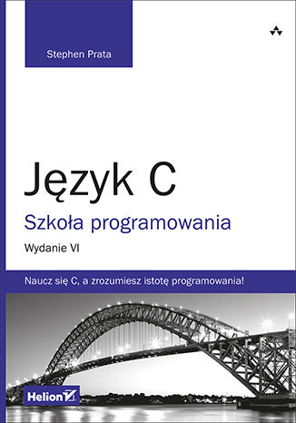

# kata-c
_Kolekcja krótkich programów, struktur danych, algorytmów zaimplementowanych w języku C._

Praca z konsolą
---------------

1. Rysowanie figur geometrycznych
    * [Prostokąt](/console/print_rectangle.c),
    * [Obramowanie prostokąta](/console/print_rectangle_with_border.c),
    * [Trójkąt prostokątny](/console/print_triangle_rectangular.c),
    * [Trójkąt równoramienny](/console/print_triangle_isosceles.c).

Algorytmy i struktury danych
----------------------------

1. Wyszukiwanie:
    * [Wyszukiwanie liniowe](/algorithms/search_line.c),
    * [Wyszukiwanie binarne](/algorithms/search_binary.c).
2. Sortowanie:
    * [Sortowanie bąbelkowe](/algorithms/bubble_sort.c).
3. Listy liniowe:
    * [Lista jednokierunkowa](/c-in-24h/24H/lnk_list.c),
    * Lista dwukierunkowa.
4. [Stos](/algorithms/stack/stack.c).

Rekurencja
----------

1. [Palindrom](/recursion/palindrome.c),
2. [Silnia](/recursion/factorial.c),
3. [Zamiana liczby dziesiętnej na liczbę dwójkową](/recursion/conver_to_binary.c).

Matematyka
----------

1. [NWD - Największy wspólny dzielnik](/math/nwd.c),
2. [NWW - Najmniejsza wspólna wielokrotność](/math/nww.c),
3. [Wyszukiwanie maksimum ze zbioru liczb całkowitych](/math/max.c),
4. [Wyszukiwanie minimum ze zbioru liczb całkowitych](/math/min.c),
5. [Średnia arytmetyczna](/math/average.c),
6. [Funkcja kwadratowa](/math/quadratic_function/quadratic_function.c),
7. [Weryfikacja, czy podana liczba to liczba pierwsza](/math/prime.c).

Pozostałe
---------

01. [Porównywanie ciągów tekstowych](/other/string_compare.c),
02. [Losowanie lotto](/other/lottery.c),
03. [Program, który weryfikuje czas trwania algorytmu](/other/algorithm_duration.c),
04. [Jeżeli wpiszesz 'x' to koniec gry](/other/x_terminate_program.c),
05. [Program, który weryfikuje, czy zostało wprowadzone słowo: 'daddy'](/other/daddy.c),
06. [Program, który potrafi tworzyć tablicę i zliczać wystąpienia podanego elementu](/other/tables.c),
07. [Program, który prezentuje obsługę linii poleceń w programie](/other/command_line.c),
08. [Program odczytujący, odwracający i wyświetlający tablicę liczb z pliku](/other/tables02.c),
09. [Program wyświetlający tekst 'Matrix cie wiezi...' - motyw z filmu 'Matrix'](/other/matrix_movie.c),
10. [Program potrafi zamienić wartości pomiędzy zmiennymi bez użycia zmiennej tymczasowej](/other/swap.c),
11. [Odbicie lustrzane liczby całkowitej](/other/mirror.c),
12. [Program, który wyprowadza na wyjście aktualną datę i czas](/other/current_time.c).

SPOJ
---------
Rozwiązania zadań ([spoj](https://pl.spoj.com/)).

01. [Tagi HTML](./spoj/html-tags.c),
02. [Kabalistyczny zapis daty](./spoj/kabbalistic-calendar.c),
03. [Szyfr Cezara](./spoj/caesar-cipher.c),
04. [XV](./spoj/xv.c),
05. [Bmi](./spoj/bmi.c),
06. [Pesel](./spoj/pesel.c),
07. [Transponowanie macierzy](./spoj/matrix-transposition.c),
08. [Dodawanie ułamków](./spoj/add-fractions.c),
09. [Problem Collatza](./spoj/the-collatz-problem.c),
10. [Literki](./spoj/letters.c),
11. [Trójkąty](./spoj/triangles.c),
12. [Sklejanie łańcuchów](./spoj/string-merge.c),
13. [Telefony](./spoj/phones.c),
14. [Warunek w tablicy](./spoj/array-condition.c),
15. [Zliczanie wystąpień](./spoj/counting-occurrences.c),
16. [Flamaster](./spoj/marker.c),
17. [Reszta z dzielenia](./spoj/rest.c),
18. [Współliniowość punktów](./spoj/points-collinearity.c),
19. [Średnia arytmetyczna](./spoj/avg.c),
20. [Szyfr Gronsfelda](./spoj/gronsfeld-cipher.c),
21. [Porównywanie dużych liczb](./spoj/large-digits.c),
22. [Histogram](./spoj/hist.c),
23. [Sortowanie punktów](./spoj/sort-points.c).

Poznaj C w 24 godziny, Tony Zhang - gotowe listingi (PL)
--------------------------------------------------------

Godzina...

01. Od czego zacząć?
    + [01L01.c: Wprowadzenie](./c-in-24h/01H/01L01.c).
02. Piszemy pierwsze programy w języku C
    + [02L01.c: Pierwszy prosty program w C](./c-in-24h/02H/02L01.c).
03. Podstawy programowania w C
    + [03L02.c: Obliczanie sumy i drukowanie wyniku na ekranie](./c-in-24h/03H/03L02.c).
04. Typy danych i słowa kluczowe języka C
    + [04L01.c: Drukowanie znakow](./c-in-24h/04H/04L01.c),
    + [04L02.c: Zamiana wartosci numerycznej na znak](./c-in-24h/04H/04L02.c),
    + [04L03.c: Wyprowadza numery kodu znakow ASCII](./c-in-24h/04H/04L03.c),
    + [04L04.c: Operacje zmiennoprzecinkowe](./c-in-24h/04H/04L04.c).
05. Zapis i odczyt informacji - odługa standardowego Wejścia / Wyjścia
    + [05L01.c: Wczytanie znaku z wejscia poprzez wywolanie funkcji getc()](./c-in-24h/05H/05L01.c),
    + [05L02.c: Wczytywanie znaku przez funkcje getchar()](./c-in-24h/05H/05L02.c),
    + [05L03.c: Funkcja putc() wysyla znak na ekran](./c-in-24h/05H/05L03.c),
    + [05L04.c: Wyswietlanie znakow za pomoca funkcji putchar()](./c-in-24h/05H/05L04.c),
    + [05L05.c: Zamiana liczb dziesietnych na szesnastkowe](./c-in-24h/05H/05L05.c),
    + [05L06.c: Okreslenie minimalnej szerokosci pola wyjsciowego](./c-in-24h/05H/05L06.c),
    + [05L07.c: Wyrownywanie wyjscia](./c-in-24h/05H/05L07.c),
    + [05L08.c: Zastosowanie specyfikatora precyzji](./c-in-24h/05H/05L08.c).
06. Manipulowanie danymi przy pomocy operatorów
    + [06L01.c: Arytmetyczne operatory przypisania](./c-in-24h/06H/06L01.c),
    + [06L02.c: Operatory pre- oraz post-inkrementacji (dekrementacji)](./c-in-24h/06H/06L02.c),
    + [06L03.c: Zastosowanie operatorow relacji - wyniki porownan](./c-in-24h/06H/06L03.c),
    + [06L04.c: Zastosowanie operatora rzutowania typu](./c-in-24h/06H/06L04.c).
07. Pętle programowe
    + [07L01.c: Zastosowanie petli typu while](./c-in-24h/07H/07L01.c),
    + [07L02.c: Zastosowanie petli do-while](./c-in-24h/07H/07L02.c),
    + [07L03.c: Zamiana 0...15 na liczby szesnastkowe](./c-in-24h/07H/07L03.c),
    + [07L04.c: Wiele wyrazen w naglowku petli for](./c-in-24h/07H/07L04.c),
    + [07L04b.c: Wiele wyrazen w naglowku petli for - przyklad 2](./c-in-24h/07H/07L04b.c),
    + [07L04c.c: Warunek przerwania pÍtli for](./c-in-24h/07H/07L04c.c),
    + [07L06.c: Petle zagniezdzone](./c-in-24h/07H/07L06.c).
08. Zastosowanie oparetorów warunkowych i więcej o operatorach C
    + [08L01.c: Zastosowanie operatora sizeof](./c-in-24h/08H/08L01.c),
    + [08L02.c: Zastosowanie operatora iloczynu logicznego AND - &&](./c-in-24h/08H/08L02.c),
    + [08L03.c: Operatory logiczne(Suma logiczna)](./c-in-24h/08H/08L03.c),
    + [08L04.c: Zastosowanie operatora negacji logicznej !](./c-in-24h/08H/08L04.c),
    + [08L05.c: Zastosowanie operatorow bitowych](./c-in-24h/08H/08L05.c),
    + [08L06.c: Zastosoanie operatorow przesuniecia](./c-in-24h/08H/08L06.c),
    + [08L07.c: Zastosowanie operatora warunkowego ? :](./c-in-24h/08H/08L07.c).
09. Modyfikatory danych i funkcje matematyczne
    + [09L01.c: Modyfikatory signed i unsigned, format binarny](./c-in-24h/09H/09L01.c),
    + [09L02.c: Zastosowanie modyfikatorow short oraz long](./c-in-24h/09H/09L02.c),
    + [09L03.c: Uzycie specyfikatorow %hd, %ld oraz %lu](./c-in-24h/09H/09L03.c),
    + [09L04.c: Zastosowanie funkcji: sin(); cos(); tan()](./c-in-24h/09H/09L04.c),
    + [09L05.c: Uzycie funkcji pow() i sqrt()](./c-in-24h/09H/09L05.c).
10. Instrukcje sterujące przebiegiem działania programu
    + [10L01.c: Zastosowanie instrukcji if](./c-in-24h/10H/10L01.c),
    + [10L02.c: Zastosowanie if-else](./c-in-24h/10H/10L02.c),
    + [10L03.c: Zagniezdzone instrukcje if](./c-in-24h/10H/10L03.c),
    + [10L04.c: Zastosowanie instrukcji switch](./c-in-24h/10H/10L04.c),
    + [10L05.c: Zastosowanie instrukcji switch-break](./c-in-24h/10H/10L05.c),
    + [10L06.c: Przerwanie nieskonczonej petli](./c-in-24h/10H/10L06.c),
    + [10L07.c: Zastosowanie instrukcji continue](./c-in-24h/10H/10L07.c).
11. Wprowadzenie do wskaźników
    + [11L01.c: Odczytanie adresow zmiennych](./c-in-24h/11H/11L01.c),
    + [11L02.c: Deklarowanie wskaznikow i przypisywanie im wartosci](./c-in-24h/11H/11L02.c),
    + [11L03.c: Zmiana zawartosci zmiennej wskazywanej](./c-in-24h/11H/11L03.c),
    + [11L04.c: Wiecej niz jeden wskaznik wskazuje na ten sam adres](./c-in-24h/11H/11L04.c).
12. Zapamiętanie wielu danych tego samego typu - macierze
    + [12L01.c: Inicjowanie tablicy int list_int = [10] = {1, 2, 3, 4, ...10}](./c-in-24h/12H/12L01.c),
    + [12L02.c: Calkowita wielkosc tablicy w bajtac](./c-in-24h/12H/12L02.c),
    + [12L03.c: Odwolanie sie do tablicy za posrednictwem wskaznika](./c-in-24h/12H/12L03.c),
    + [12L04.c: Wydruk elementow tablicy znakowej](./c-in-24h/12H/12L04.c),
    + [12L05.c: Stop po napotkaniu znaku \0](./c-in-24h/12H/12L05.c),
    + [12L06.c: Wydruk tablicy dwuwymiarowej](./c-in-24h/12H/12L06.c),
    + [12L07.c: Inicjowanie tablic bezwymiarowych](./c-in-24h/12H/12L07.c).
13. Manipulowanie łańcuchami znakowymi
    + [13L01.c: Inicjowanie lancuchow znakowych](./c-in-24h/13H/13L01.c),
    + [13L02.c: Pomiar dlugosci lancuchow tekstowych](./c-in-24h/13H/13L02.c),
    + [13L03.c: Kopiowanie lancuchow](./c-in-24h/13H/13L03.c),
    + [13L04.c: Zastosowanie funkcji gets() i puts()](./c-in-24h/13H/13L04.c),
    + [13L05.c: Zastosowanie funkcji scanf()](./c-in-24h/13H/13L05.c).
14. Klasy zmiennych - widoczność i lokalizacja w pamięci
    + [14L01.c: Zmienne lokalne w blokach zagniezdzonych](./c-in-24h/14H/14L01.c),
    + [14L02.c: Porownanie zakresow program scope - kontra - block scope](./c-in-24h/14H/14L02.c),
    + [14L03.c: Zastosowanie specyfikatora static zmiennej statycznej](./c-in-24h/14H/14L03.c).
15. O funkcjach w C
    + [15L01.c: Deklaracja, definicja i wywolanie funkcji](./c-in-24h/15H/15L01.c),
    + [15L02.c: Funkcja bezargumentowa, nie zwraca wartosci](./c-in-24h/15H/15L02.c),
    + [15L03.c: Obsluga zmiennej liczby argumentow](./c-in-24h/15H/15L03.c).
16. Zastosowanie wskaźników
    + [16L01.c: Arytmetyka wskaznikow](./c-in-24h/16H/16L01.c),
    + [16L02.c: Odejmowanie wskaznikow](./c-in-24h/16H/16L02.c),
    + [16L03.c: Dostep do tablic przy pomocy wskaznikow](./c-in-24h/16H/16L03.c),
    + [16L04.c: Przekazywanie tablicy do funkcji](./c-in-24h/16H/16L04.c),
    + [16L05.c: Przekazywanie wskaznikow do funkcji](./c-in-24h/16H/16L05.c),
    + [16L06.c: Przekazywanie tablic wielowymiarowych](./c-in-24h/16H/16L06.c),
    + [16L07.c: Przekazywanie tablicy wskaznikow do funkcji](./c-in-24h/16H/16L07.c),
    + [16L08.c: Wskazanie funkcji](./c-in-24h/16H/16L08.c).
17. Dynamiczne przyporządkowanie pamięci
    + [17L01.c: Zastosowanie funkcji malloc()](./c-in-24h/17H/17L01.c),
    + [17L02.c: Zastosowanie funkcji free()](./c-in-24h/17H/17L02.c),
    + [17L03.c: Zastosowanie funkcji calloc()](./c-in-24h/17H/17L03.c),
    + [17L04.c: Zastosowanie funkcji realloc()](./c-in-24h/17H/17L04.c).
18. Więcej o typach danych i o funkcjach
    + [18L01.c: Definiowanie typow wyliczeniowych](./c-in-24h/18H/18L01.c),
    + [18L02.c: Zastosowanie wyliczeniowego typu danych](./c-in-24h/18H/18L02.c),
    + [18L03.c: Zastosowanie definiowania typu przy pomocy typedef](./c-in-24h/18H/18L03.c),
    + [18L04.c: Rekurencja funkcji](./c-in-24h/18H/18L04.c),
    + [18L05.c: Pobranie parametrow z wiersza polecen SysOp](./c-in-24h/18H/18L05.c).
19. Struktury - łączenie danych różnych typów
    + [19L01.c: Odwolywanie sie do pol struktury](./c-in-24h/19H/19L01.c),
    + [19L02.c: Inicjowanie pol struktury](./c-in-24h/19H/19L02.c),
    + [19L03.c: Przekazanie struktury jako argumentu funkcji](./c-in-24h/19H/19L03.c),
    + [19L04.c: Wskaznik do struktury](./c-in-24h/19H/19L04.c),
    + [19L05.c: Tablica struktur](./c-in-24h/19H/19L05.c),
    + [19L06.c: Zastosowanie zagniezdzonych struktur](./c-in-24h/19H/19L06.c).
20. Zrozumienie istoty pojęcia unii w języku C
    + [20L01.c: Odwolywanie sie do unii](./c-in-24h/20H/20L01.c),
    + [20L02.c: Nakladanie sie elementow unii](./c-in-24h/20H/20L02.c),
    + [20L03.c: Pomiar rozmiaru unii i struktury](./c-in-24h/20H/20L03.c),
    + [20L04.c: Odwolanie do tej samej pamieci na rozne sposoby](./c-in-24h/20H/20L04.c),
    + [20L05.c: Zastosowanie unii](./c-in-24h/20H/20L05.c),
    + [20L06.c: Definiowanie pol bitowych](./c-in-24h/20H/20L06.c).
21. Zapis do- i odczyt z- plików dyskowych
    + [21L01.c: Otwieranie i zamykanie pliku](./c-in-24h/21H/21L01.c),
    + [21L02.c: Odczyt i zapis z/do pliku znak-po-znaku](./c-in-24h/21H/21L02.c),
    + [21L03.c: Wczytywanie i zapis wiersz po wierszu](./c-in-24h/21H/21L03.c),
    + [21L04.c: Zapis i odczyt bloku znakow](./c-in-24h/21H/21L04.c).
22. Zastosowanie specjalnych funkcji do obsługi odczytu i zapisu plików
    + [22L01.c: Swobodny dostep do pliku](./c-in-24h/22H/22L01.c),
    + [22L02.c: Odczyt i zapis danych binarnych](./c-in-24h/22H/22L02.c),
    + [22L03.c: Zastosowanie funkcji fscanf() i fprintf()](./c-in-24h/22H/22L03.c),
    + [22L04.c: Skierowanie standardowego strumienia stdout do pliku dyskowego](./c-in-24h/22H/22L04.c).
23. Kompilacja programów: Preprocesor C
    + [23L01.c: Uzycie dyrektywy #define](./c-in-24h/23H/23L01.c),
    + [23L02.c: Zastosowanie #ifdef, #ifndef, #endif](./c-in-24h/23H/23L02.c),
    + [23L03.c: Zastosowanie dyrektyw #if #elif #else](./c-in-24h/23H/23L03.c),
    + [23L04.c: Zagniezdzenie #if](./c-in-24h/23H/23L04.c).
24. Co dalej?
    + [24L01.c: Interfejs dla listy ciaglej](./c-in-24h/24H/24L01.c),
    + [lnk_list.c: Funkcje manipulujace lista](./c-in-24h/24H/lnk_list.c),
    + [lnk_list.h: Plik naglowkowy dla listy](./c-in-24h/24H/lnk_list.h).

Język C, Szkoła programowania, Stephen Prata - rozwiązania zadań
--------------------------------------------------------

**Notatki:**

7 etapów programowania:

1. Określenie celów programu.
2. Projektowanie programu.
3. Pisanie kodu.
4. Kompilacja.
5. Uruchomienie programu.
6. Testowanie i usuwanie błędów.
7. "Pielęgnowanie" i modyfikacja programu.

**Rozdział...**

01. Zaczynamy
    + [r01z01.c: Przeliczanie cali na cm](./s-prata/r01/r01z01.c).
02. Wstęp do C
    + [r02z01.c: Program wypisujący na ekranie imię i nazwisko](./s-prata/r02/r02z01.c),
    + [r02z02.c: Program wypisujący na ekranie imię oraz adres](./s-prata/r02/r02z02.c),
    + [r02z03.c: Program przeliczający wiek użytkownika na dni](./s-prata/r02/r02z03.c),
    + [r02z04.c: Proste wywołania funkcji](./s-prata/r02/r02z04.c),
    + [r02z05.c: Operacje na liczbie całkowitej](./s-prata/r02/r02z05.c),
    + [r02z06.c: Proste wywołania funkcji smile()](./s-prata/r02/r02z06.c).
03. Dane w C
    + [r03z01.c: Eksperyment przepełnienia](./s-prata/r03/r03z01.c),
    + [r03z02.c: Kod ASCII](./s-prata/r03/r03z02.c),
    + [r03z03.c: Sygnał](./s-prata/r03/r03z03.c),
    + [r03z04.c: Notacja wykładnicza](./s-prata/r03/r03z04.c),
    + [r03z05.c: Przelicz wiek użytkownika na sekundy](./s-prata/r03/r03z05.c),
    + [r03z06.c: Oblicz liczbę cząsteczek wody w podanej objętości](./s-prata/r03/r03z06.c).
04. Łańcuchy znakowe i formatowane wejście / wyjście
    + [r04z01.c: Wypisz imię i nazwisko](./s-prata/r04/r04z01.c),
    + [r04z02.c: Formatowanie tekstu](./s-prata/r04/r04z02.c),
    + [r04z03.c: Formatowanie liczb zmiennoprzecinkowych](./s-prata/r04/r04z03.c),
    + [r04z04.c: Wzrost użytkownika](./s-prata/r04/r04z04.c),
    + [r04z05.c: Formatowanie tekstu i wykorzystanie funkcji strlen()](./s-prata/r04/r04z05.c).
05. Operatory, wyrażenia i instrukcje
    + [r05z01.c: Przelicz minuty na godziny i minuty](./s-prata/r05/r05z01.c),
    + [r05z02.c: Wyświetl liczby całkowite](./s-prata/r05/r05z02.c),
    + [r05z03.c: Przelicz dni na tygodnie i dni](./s-prata/r05/r05z03.c),
    + [r05z04.c: Ile masz gotówki w portfelu?](./s-prata/r05/r05z04.c),
    + [r05z05.c: Suma kwadratów kolejnych liczb naturalnych](./s-prata/r05/r05z05.c),
    + [r05z06.c: Liczba zmiennoprzecinkowa podniesiona do 3 potęgi](./s-prata/r05/r05z06.c).
06. Instrukcje sterujące C: Pętle
    + [r06z01.c: Tabica zawierająca 26 małych liter](./s-prata/r06/r05z01.c),
    + [r06z02.c: Zbuduj trójkąt z dolarów](./s-prata/r06/r06z02.c),
    + [r06z03.c: Zbuduj trójkąt zawierający znaki F..A](./s-prata/r06/r06z03.c),
    + [r06z04.c: Zbuduj piramidę znakową](./s-prata/r06/r06z04.c),
    + [r06z05.c: Wyświetlanie tabeli](./s-prata/r06/r06z05.c),
    + [r06z06.c: Wspak](./s-prata/r06/r06z06.c),
    + [r06z07.c: Operacje na 2 liczbach zmiennoprzecinkowych](./s-prata/r06/r06z07.c),
    + [r06z08.c: Operacje na 2 liczbach zmiennoprzecinkowych + funkcja](./s-prata/r06/r06z08.c),
    + [r06z09.c: Wyświetl liczby całkowite w odwrotnej kolejności](./s-prata/r06/r06z09.c).
